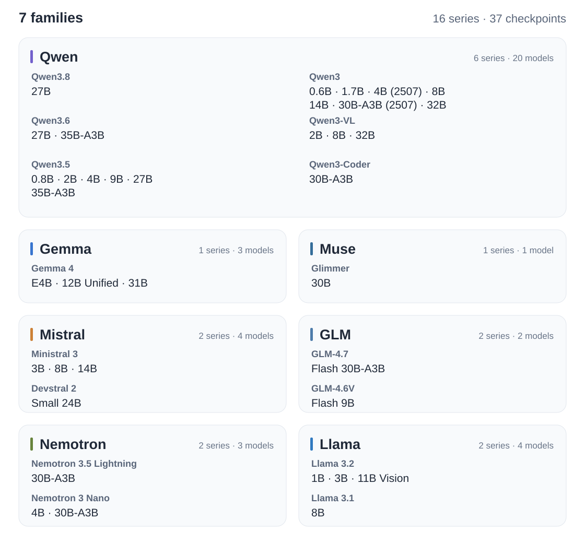

<p align="center">
  
</p>

<p align="center">
  <a href="https://huggingface.co/collections/tianxinwei/jevany-adaptive-decision-systems-6ab2c941bcecb4d2c61d1326"></a>
  <a href="docs/API.md"></a>
  <a href="docs/CASES.md"></a>
  <a href="pyproject.toml"></a>
  <a href="https://github.com/weitianxin/JevAny/actions"></a>
  <a href="LICENSE"></a>
</p>

<p align="center">
  <strong>English</strong> | <a href="README.zh-CN.md">简体中文</a>
</p>

Train and serve Jev-style decision models with JevAny: fine-tune an open language model or use our pretrained checkpoint. The shared [Python and HTTP APIs](docs/API.md) follow the Jev format, taking a state, question, and candidate answers and returning a choice with per-option probabilities.

<p align="center">
  
</p>

| Start here | What JevAny provides |
|---|---|
| **[Training](#training)** | Training data and shared SFT/RLCR infrastructure |
| **[Inference & Serving](#inference--serving)** | Pretrained models, a shared API, test environments, and application examples |

## Demos

Examples built with [JevAny-27B-SFT](https://huggingface.co/tianxinwei/JevAny-27B-SFT):

[](docs/CASES.md)

[Explore 30 selected successful runs](docs/CASES.md), or try your own model with the [examples and test environments](#examples--test-environments).

## Installation

Use Python 3.12 or newer. Clone the repository and create an environment:

```bash
git clone https://github.com/weitianxin/JevAny.git
cd JevAny
python3.12 -m venv .venv
source .venv/bin/activate
```

Choose the dependencies for your use case:

| Use case | Install |
|---|---|
| Call an existing HTTP server | `python -m pip install -e .` |
| Train a text model | `python -m pip install -e '.[train]'` |
| Run a text model locally or serve it over HTTP | `python -m pip install -e '.[serve]'` |
| Run the released 27B models with native media support | `python -m pip install -e '.[serve,multimodal]'` |

The client-only installation does not install PyTorch. For image/video training, use `.[train,multimodal]`. Run the commands below from the repository root; model-specific hardware requirements are listed under [Pretrained Models](#pretrained-models).

## Training

### Training Data

Training uses the same `state` and `questions` as inference, with a `label` added to each question.

| Data | What is available | Start here |
|---|---|---|
| Included starter | Small synthetic dataset for learning the workflow | `jevany data init --out data/starter` |
| Public-source builders | Text, image and video decision data | [Data-building guide](docs/TRAINING.md#data-beyond-the-starter) |
| Your own data | Labelled requests in the shared JSONL format | [Format and examples](docs/DATA.md) |

Prepare and validate the starter before training:

```bash
jevany data init --out data/starter
jevany data validate data/starter/train.jsonl
```

### SFT

Supervised fine-tuning fits a Jev model to labelled decisions. Run the starter recipe on a CUDA GPU:

```bash
jevany train --config recipes/sft.toml --dry-run
jevany train --config recipes/sft.toml
```

The checkpoint is saved to `runs/my-jev`. To use your own data, add `--data data/my-domain.jsonl --out runs/domain-jev`. To adapt a released Jev model, use [`recipes/finetune.toml`](recipes/finetune.toml).

### RLCR

Reinforcement Learning with Calibration Rewards continues SFT with a reward based on both correctness and confidence. After completing the SFT recipe above, run:

```bash
jevany train --config recipes/rlcr.toml
```

This recipe continues training from `runs/my-jev` and saves to `runs/my-jev-rlcr`. RLCR is under active development; see the [training objective](docs/ALGORITHM.md#rlcr).

See the [training guide](docs/TRAINING.md#backbone-support) for supported backbones, image and video capabilities, and local GPU setup.

## Pretrained Models

| Model | Intended use |
|---|---|
| [JevAny-27B-SFT](https://huggingface.co/tianxinwei/JevAny-27B-SFT) | Default released model |
| [JevAny-27B-RLCR](https://huggingface.co/tianxinwei/JevAny-27B-RLCR) | Experimental RLCR continuation |

Both releases load a 27B vision-capable base on first use. Allow about 54 GB for BF16 base weights, plus runtime memory, on a single device. You can also train a smaller model and serve it through the same API. See the [hardware and loading guide](docs/DEPLOYMENT.md#checkpoints-and-hardware).

## Inference & Serving

### Python API

With an [HTTP server](#http-server) running, send a state and a question with named options. The answer contains the selected option and each option's probability:

```python
from jevany import Choice, JevClient

state = {"ticket": "I was charged twice. Please help."}
questions = {
    "department": Choice(
        instructions="Which team should handle this?",
        criteria={"billing": "Payment problems", "shipping": "Delivery problems"},
    ),
}

jev = JevClient("http://127.0.0.1:8008")
result = jev.system_one(state=state, questions=questions)
answer = result["answers"]["department"]
print(answer["choice"])
print(answer["probabilities"])
```

Use `Noul` for binary questions and `Score` for ordered levels. The [API reference](docs/API.md) describes all three question types and the Jev-compatible request/answer format.

### HTTP Server

For the default released model, install `.[serve,multimodal]` and use hardware that meets the [27B requirements](#pretrained-models):

```bash
jevany serve --checkpoint tianxinwei/JevAny-27B-SFT \
  --device cuda --dtype bf16 --port 8008
```

To serve the smaller model from the SFT example instead:

```bash
jevany serve --checkpoint runs/my-jev --model-name my-jev --port 8008
```

### In-Process Inference

Load a checkpoint once in your application and reuse `state` and `questions` from the example above:

```python
from jevany import JevModel

jev = JevModel.from_pretrained("runs/my-jev", model_name="my-jev")
result = jev.system_one(state=state, questions=questions)
```

See the [deployment guide](docs/DEPLOYMENT.md) for more ways to call a model and [media setup](docs/DEPLOYMENT.md#native-media-and-limits) for image and video inputs.

## Examples & Test Environments

Open the playground in your local browser. The included replays need no GPU, model download, or inference server:

```bash
python -m pip install -e .
jevany demo
```

These GIFs show accelerated replays of JevAny-27B-SFT controlling the environments. Each replay preserves the model's actual choices and original option probabilities.

### [Doom corridor · 3D](examples/README.md#doom-corridor-3d)

Reach the green armor at the far end of a hostile corridor, using ViZDoom and the included Freedoom assets.


### [Crafter survival · 2D](examples/README.md#crafter-survival-2d)

Gather wood, craft tools and mine stone while managing health and supplies.


### [Robot peg insertion](examples/README.md#robot-peg-insertion)

Use a Franka gripper to grasp, align and insert a peg, checked by PyBullet contact physics.


### Live control

Install the optional game engines to play yourself, or connect a [running model server](#http-server) and choose **Run model** in the browser:

```bash
python -m pip install -e '.[demo]'
jevany demo --base-url http://127.0.0.1:8008 --text-only
```

Live model runs currently use text state. Robot control uses the separate `.[robotics]` extra. See the [playground guide](examples/README.md) for setup, platform requirements and environment APIs, or [integrations](docs/INTEGRATIONS.md) to combine Jev decisions with an LLM planner.

## Evaluation


[Full results and evaluation protocols](docs/EVALUATION.md).

## Supported Model Families



[Model IDs, supported inputs and setup requirements](docs/TRAINING.md#backbone-support).

## Documentation and Contributing

[Training](docs/TRAINING.md) · [Deployment](docs/DEPLOYMENT.md) · [API compatibility](docs/API.md) · [Data](docs/DATA.md) · [Evaluation](docs/EVALUATION.md) · [Contributing](CONTRIBUTING.md)

JevAny is independent of Jev and TypeSafe and includes no Jev weights or private implementation. It includes infrastructure adapted from [Kev](https://github.com/jaredpalmer/kev); see [NOTICE](NOTICE) and [ACKNOWLEDGEMENTS.md](ACKNOWLEDGEMENTS.md). Code and starter data are Apache-2.0. Base models and upstream datasets retain their own terms.
