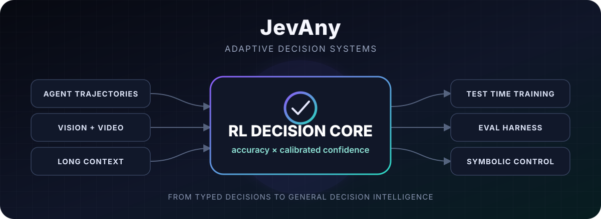

<p align="center">
  
</p>

<p align="center">
  <a href="https://github.com/weitianxin/JevAny/releases/tag/v0.1.0"></a>
  <a href="https://huggingface.co/collections/tianxinwei/jevany-6ab2c941bcecb4d2c61d1326"></a>
  <a href="https://github.com/weitianxin/JevAny/actions"></a>
  <a href="LICENSE"></a>
  
</p>

JevAny turns context into typed decisions and calibrated probabilities. It is a Qwen3.8-27B decision model, not a chat model: one prefill scores every option, returns no generated reasoning, and can answer several independent questions about the same state.

The first release contains two LoRA checkpoints:

- [**JevAny-27B-SFT**](https://huggingface.co/tianxinwei/JevAny-27B-SFT) — the selected epoch-1 supervised checkpoint.
- [**JevAny-27B-RLCR**](https://huggingface.co/tianxinwei/JevAny-27B-RLCR) — the SFT model refined with reinforcement learning with calibration rewards.

Both checkpoints are grouped in the [JevAny collection](https://huggingface.co/collections/tianxinwei/jevany-6ab2c941bcecb4d2c61d1326). They require the separately distributed `Qwen/Qwen3.8-27B` base model.

## Why JevAny

Many applications need a decision, not another paragraph: route a case, choose an action, score severity, or decide whether evidence is sufficient. JevAny keeps the output space explicit.

- **Typed outputs.** Binary (`noul`), categorical (`choice`), and ordinal (`score`) questions use one API.
- **Confidence is part of the model.** Each option receives a probability from the pointer head.
- **No answer decoding.** Inference ends after the prefill pass.
- **Shared context.** Several questions reuse one state while remaining isolated from one another.
- **Trainable on your schema.** Fine-tuning data uses the same JSON shape as inference, plus labels.

This release is the text decision core. The roadmap extends that core to complex tasks, agent trajectories, vision and video, long context, test-time training, evaluation harnesses, and symbolic task-specific decision trees.

## Quick Start

```bash
git clone https://github.com/weitianxin/JevAny.git
cd JevAny
python -m venv .venv
source .venv/bin/activate
pip install -e '.[serve]'
```

Download a checkpoint, then start the API:

```bash
hf download tianxinwei/JevAny-27B-RLCR \
  --local-dir models/JevAny-27B-RLCR

JEVANY_DTYPE=bf16 python -m jevany.serve \
  --run models/JevAny-27B-RLCR \
  --device cuda --port 8008
```

Send one state and any number of questions:

```bash
curl http://127.0.0.1:8008/v1/systemone \
  -H 'content-type: application/json' \
  -d '{
    "model": "jevany-27b",
    "state": {
      "ticket": "The parcel is ten days late and the card was charged twice.",
      "customer_tier": "premium"
    },
    "questions": {
      "department": {
        "type": "choice",
        "instructions": "Which team should handle this first?",
        "criteria": {
          "billing": "Charges and payment problems",
          "shipping": "Delivery delays and lost parcels",
          "returns": "Returns and exchanges"
        }
      },
      "urgent": {
        "type": "noul",
        "instructions": "Does this require human review within one hour?"
      }
    }
  }'
```

The response contains the selected answer, its normalized confidence, and the option distribution. See [docs/DATA.md](docs/DATA.md) for all three question types and the training format.

## Results

All rows below were evaluated on the same held-out `transfer-v9` development panel. Accuracy excludes explicitly unknowable questions; Brier and coverage use calibrated probabilities. Higher is better except Brier.

| Model | Knowable accuracy | MMLU-Pro | Buried evidence | Brier ↓ | Coverage @ 5% error | Unknowable mean confidence ↓ |
|---|---:|---:|---:|---:|---:|---:|
| Kev-9B | 77.15% | 51.50% | 73.75% | 0.341 | 39.29% | 0.412 |
| JevAny-27B-SFT | 81.36% | 64.00% | 73.75% | 0.273 | 51.63% | 0.499 |
| **JevAny-27B-RLCR** | **81.84%** | **66.00%** | **73.75%** | **0.269** | **54.11%** | **0.428** |
| Jev | 85.37% | 84.00% | 70.00% | 0.212 | 69.50% | 0.610 |

RLCR changes accuracy by +0.48 percentage points over SFT on this panel (11 fixes, 6 regressions; exact McNemar `p=0.332`). The clearer result is better uncertainty behavior: lower Brier score, higher selective coverage, and lower confidence on unknowable inputs. Treat the accuracy difference as directional, not conclusive.

On one H200, a single one-question query measured 156.8 ms median for SFT and 153.8 ms for RLCR (`p95` 162.7/160.1 ms). This is model compute per request; network and queueing are excluded.

The saved measurements and evaluation policy live in [results/release-v0.1.json](results/release-v0.1.json) and the two model cards.

## How It Works

```text
state ───────────────┬─ question A ─ options ─ <decide> ─ probabilities A
                     ├─ question B ─ options ─ <decide> ─ probabilities B
                     └─ question C ─ options ─ <decide> ─ probabilities C
```

The Qwen backbone reads the shared state and one causal row per question. A learned pointer head compares the hidden state at `<decide>` with each option boundary. Softmax over those scores gives the answer distribution. Because Qwen3.8 uses hybrid recurrent layers, JevAny runs each question as a separate causal row rather than pretending a custom block mask applies inside recurrent state.

SFT minimizes cross-entropy on hard or soft targets. RLCR samples groups of noisy pointer-logit proposals and optimizes

```text
reward = correctness - (confidence - correctness)²
```

with a group-centered advantage and a small supervised loss. This is a decision-only adaptation of [RLCR](https://arxiv.org/abs/2507.16806): it does not generate confidence tokens or reasoning traces, and it is not standard token-level GRPO. [docs/ALGORITHM.md](docs/ALGORITHM.md) gives the objective and implementation details.

## Fine-Tuning

One JSON object per line is enough. The inference request gains a `label` on every question; an optional `target` provides a soft distribution for uncertain examples.

```bash
torchrun --nproc_per_node=8 -m jevany.train \
  --base Qwen/Qwen3.8-27B \
  --data examples/train.jsonl \
  --lora 16 --weights_dtype bf16 --dtype bf16 \
  --epochs 1 --out runs/my-sft
```

Continue from SFT with calibration-aware RL:

```bash
torchrun --nproc_per_node=8 -m jevany.train \
  --base Qwen/Qwen3.8-27B \
  --data data/rlcr.jsonl --init_from runs/my-sft \
  --rlcr --rlcr_group_size 32 \
  --rlcr_sigma_start 0.4 --rlcr_sigma_end 0.1 --rlcr_ce_w 0.25 \
  --weights_dtype bf16 --dtype bf16 --epochs 1 --out runs/my-rlcr
```

Training supports multi-node DDP, distributed evaluation before training and at fixed step intervals, checkpointing, and W&B. The exact v0.1 commands are in [`scripts/train_sft.sh`](scripts/train_sft.sh) and [`scripts/train_rlcr.sh`](scripts/train_rlcr.sh).

## Roadmap

JevAny is aimed at decision systems that can improve the task representation as well as the model.

- [x] Text-only typed decision model on Qwen3.8-27B
- [x] LoRA SFT, distributed training/evaluation, and calibrated checkpoints
- [x] Decision-only RLCR with hard-example replay and knowable/unknowable pairs
- [ ] Complex-task and agent-trajectory data generation with auditable labels
- [ ] Image and video evidence as first-class state
- [ ] Long-context retrieval, state compression, and persistent decision memory
- [ ] Test-time training with rollback, contamination checks, and budget controls
- [ ] A task harness for calibration, robustness, latency, and agent outcomes
- [ ] LLM-generated task-specific symbolic decision trees that route into JevAny leaves

The detailed milestones and acceptance criteria are in [ROADMAP.md](ROADMAP.md).

## Scope

The v0.1 checkpoints accept text or JSON-renderable state. Although the Qwen3.8 base includes a vision tower, this release does not connect images or video to the decision path. The training envelope is 2,048 packed tokens; serving allows up to 8,192 state tokens and 8,192 tokens per question branch, but that longer range was not trained as a first-class capability. Probabilities are calibrated measurements on the published evaluation distribution, not guarantees for a new deployment.

## Attribution

JevAny is a modified derivative of [Kev](https://github.com/jaredpalmer/kev) by Jared Palmer, used under Apache-2.0. The repository keeps attribution in [NOTICE](NOTICE), marks derived files, and summarizes the changes in [ACKNOWLEDGEMENTS.md](ACKNOWLEDGEMENTS.md). It contains no Jev weights or private implementation. See the acknowledgements for Qwen, Jev/System One, and the RLCR paper.

## License

Apache-2.0. Base-model terms apply separately to Qwen3.8-27B.
