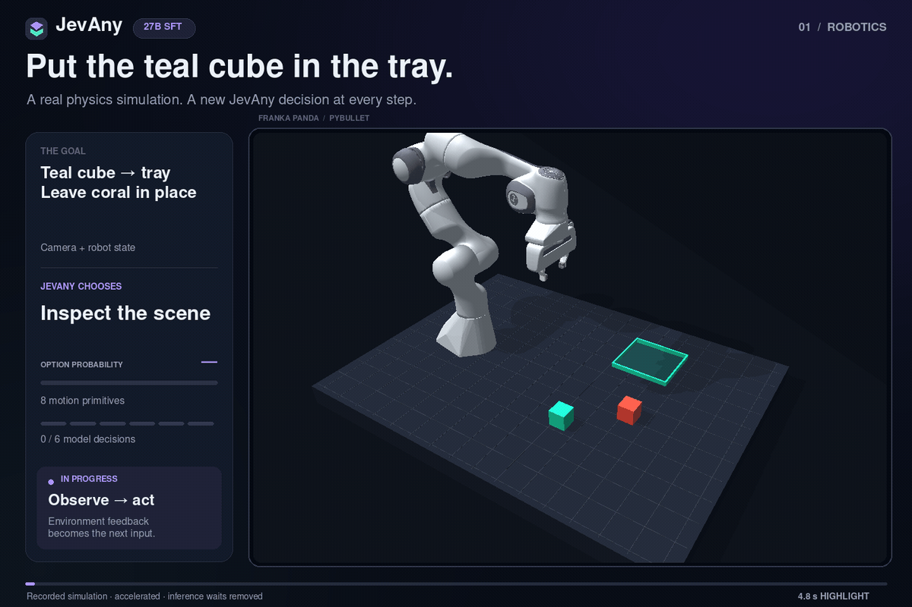
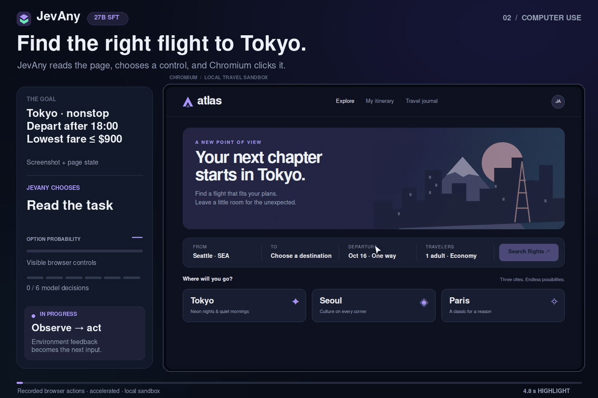
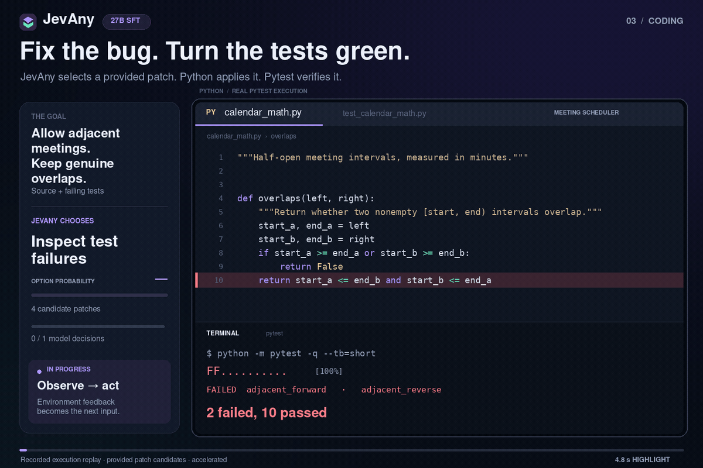

<p align="center">
  
</p>

<p align="center">
  <a href="https://github.com/weitianxin/JevAny"></a>
  <a href="https://huggingface.co/collections/tianxinwei/jevany-adaptive-decision-systems-6ab2c941bcecb4d2c61d1326"></a>
  <a href="https://github.com/weitianxin/JevAny/actions"></a>
  <a href="LICENSE"></a>
</p>

JevAny is a calibrated decision layer for reinforcement learning, agents, multimodal evidence, and model harnesses. It turns shared context into typed answers and option probabilities in one prefill pass. It does not generate an answer or a reasoning trace.

The current 27B release uses a Qwen3.8 backbone and contains two rank 16 LoRA checkpoints:

- [JevAny-27B-SFT](https://huggingface.co/tianxinwei/JevAny-27B-SFT) is the recommended general checkpoint.
- [JevAny-27B-RLCR](https://huggingface.co/tianxinwei/JevAny-27B-RLCR) is an experimental calibration-reward checkpoint.

Both require separately distributed base weights and the JevAny runtime.

## See It Act

The released **JevAny-27B-SFT** checkpoint drives all three demos by choosing among explicit actions. Each **4.8-second** highlight shows recorded execution with accelerated playback and inference waits removed.

<table width="100%">
  <tr>
    <td width="34%" valign="middle">
      <h3>Robotics</h3>
      <p><strong>Pick, lift, and place</strong></p>
      <p>Camera images and simulator state guide six decisions from eight available motion primitives. PyBullet simulates the finger contacts and object motion; the teal cube reaches the tray while the coral cube stays in place.</p>
    </td>
    <td width="66%" align="center" valign="middle">
      
    </td>
  </tr>
</table>

<table width="100%">
  <tr>
    <td width="66%" align="center" valign="middle">
      
    </td>
    <td width="34%" valign="middle">
      <h3>Computer use</h3>
      <p><strong>Find the right flight</strong></p>
      <p>JevAny reads screenshots and page state, then selects controls for Playwright to click in a real Chromium browser. In this local travel sandbox, it finds the cheapest nonstop flight departing after 18:00 within a $900 budget: <strong>19:10, $840</strong>.</p>
    </td>
  </tr>
</table>

<table width="100%">
  <tr>
    <td width="34%" valign="middle">
      <h3>Coding</h3>
      <p><strong>Code repair, review, and validation</strong></p>
      <p>Use JevAny as a decision layer for software maintenance: assess candidate changes against source context, bug reports, and test evidence, then connect the selected repair to execution and validation. This demo follows a complete repair loop—from reproducing a regression to applying the selected fix and verifying the resulting behavior.</p>
    </td>
    <td width="66%" align="center" valign="middle">
      
    </td>
  </tr>
</table>

The first successful run in each predefined list is shown. The [execution record](docs/demos/action-demo-runs.json) retains all eight illustrative trials, all 35 decisions and option distributions, the exact checkpoint, selection rules, and scope. Broader agent benchmarks remain part of the [roadmap](ROADMAP.md).

## One Core, Several Systems

| System | What it does | Status |
|---|---|---|
| **Jev-Judge** | Typed choice, binary, and ordinal decisions with confidence | Released |
| **Jev-Agent** | Chooses actions in multi-step environments | Prototype evaluated |
| **Jev-Harness** | Lets an LLM compile open-ended tasks into bounded decisions | Prototype |
| **Jev-Tool** | Selects tools, execution modes, and escalation paths | Prototype |
| **Jev-Symbolic** | Runs LLM-authored, validated decision trees with JevAny at each node | Prototype |
| **Jev-Test** | Adapts from repeated samples without ground-truth labels | Research result |
| **Jev-Image** | Makes decisions from native image evidence | Evaluated with blank and shuffled controls |
| **Jev-Video** | Scores native video evidence | Evaluated on three temporal decision tasks |

Next priorities are harder agent tasks, long context, document images, broader temporal reasoning, broader computer-use, coding and robotics evaluations, and guarded test-time updates. See [ROADMAP.md](ROADMAP.md) for acceptance criteria.

## Quick Start

```bash
git clone https://github.com/weitianxin/JevAny.git
cd JevAny
python -m venv .venv
source .venv/bin/activate
pip install -e '.[serve]'

hf download tianxinwei/JevAny-27B-SFT \
  --local-dir models/JevAny-27B-SFT

JEVANY_DTYPE=bf16 python -m jevany.serve \
  --run models/JevAny-27B-SFT --device cuda --port 8008
```

Send one state and up to 64 questions:

```bash
curl http://127.0.0.1:8008/v1/systemone \
  -H 'content-type: application/json' \
  -d '{
    "model": "jevany-27b",
    "state": {
      "ticket": "The parcel is ten days late and the card was charged twice.",
      "customer_tier": "premium"
    },
    "questions": {
      "department": {
        "type": "choice",
        "instructions": "Which team should handle this first?",
        "criteria": {
          "billing": "Charges and payment problems",
          "shipping": "Delivery delays and lost parcels",
          "returns": "Returns and exchanges"
        }
      },
      "urgent": {
        "type": "noul",
        "instructions": "Does this require human review within one hour?"
      }
    }
  }'
```

The response includes the selected answer, normalized confidence, and the full option distribution. [docs/DATA.md](docs/DATA.md) defines the request and training formats.

## Results

The v2 checkpoints were selected on separate development and transfer panels. Higher is better except NLL.

| Model | Development accuracy | Development NLL ↓ | Transfer accuracy | MMLU-Pro | AI2D | MMMU |
|---|---:|---:|---:|---:|---:|---:|
| **JevAny-27B-SFT v2** | **90.34%** | 0.265 | **82.41%** | 73.0% | 86.0% | **68.0%** |
| JevAny-27B-RLCR v2 | 89.74% | **0.260** | 82.31% | **73.5%** | **87.0%** | 63.0% |
| Jev | n/a | n/a | 85.37% | 84.0% | n/a | n/a |

RLCR changed transfer accuracy by `-0.10` percentage points against SFT, with 3 fixes and 4 regressions. The paired 95% bootstrap interval is `[-0.58, 0.39]` points. Its small development NLL gain did not transfer after independent calibration, so SFT remains the default. Jev is a different hosted system evaluated through the same decision suite, not a weight-matched ablation.

Development accuracy and NLL exclude 100 VideoFeedback questions whose labels are all the same highest score. The video path was exercised, but that slice is not evidence of temporal understanding and is not reported as a capability score. AI2D and MMMU use native images through the backbone's vision path. The training set also contains native A-OKVQA and ScienceQA images.

<p align="center">
  
</p>

### Native Image And Video Decisions

We evaluated the released SFT checkpoint with the real media, a neutral blank asset, and media shuffled between questions within each task. Shuffling operates on unique media groups, so questions that share one image or video always receive the same replacement. The media sensitivity gate requires full-media accuracy to exceed the stronger control by at least five points, with a positive paired media-group bootstrap interval. Passing it shows that the model uses the media; it does not by itself establish high task accuracy.

| Panel | Questions | Full media | Blank | Shuffled | Gain over strongest control |
|---|---:|---:|---:|---:|---:|
| **MMStar clean image panel** | 1,330 | **74.5%** | 29.0% | 28.9% | **+45.5** `[+42.4, +48.6]` |
| **MVBench three-task video panel** | 600 | **33.5%** | 12.3% | 15.3% | **+18.2** `[+13.9, +22.4]` |

| MVBench task | Questions | Full media | Blank | Shuffled | Gain over strongest control |
|---|---:|---:|---:|---:|---:|
| Fine-grained action | 200 | **45.0%** | 14.0% | 16.5% | **+28.5** `[+19.5, +37.5]` |
| Egocentric navigation | 200 | **43.5%** | 23.0% | 29.0% | **+14.5** `[+6.3, +22.4]` |
| Action antonym | 200 | **12.0%** | 0.0% | 0.5% | **+11.5** `[+7.0, +16.0]` |

The image panel removes invalid choices and every item matched to the training, calibration, or development splits by media or by normalized question and unordered option text. It has zero remaining exact or perceptual media overlap, question-option overlap, and source-ID overlap. Its task-macro random and label-position baselines are 26.7% and 31.8%. The video panel has the same zero-overlap checks. Its overall media gain is significant, but the low action-antonym score and poor video calibration are important limitations.

Full metrics, per-task intervals, dataset revisions, checkpoint hashes, and control provenance are in [the image report](results/multimodal-image-v1.json) and [the video report](results/multimodal-video-v1.json). The internal evaluation checkpoint and public SFT release have identical LoRA and pointer-head tensors; [the equivalence record](results/release-equivalence-v0.2.json) accounts for the embedded release temperature. Benchmark media is not redistributed because its upstream terms apply.

The examples below use self-created synthetic media released with this repository. Each modality shows one fixed middle-confidence success and one alternate case from three predeclared examples. [The selection record](docs/demos/multimodal-demo.json) includes every probability.

<table>
  <tr>
    <td width="50%" align="center"><br><b>Jev-Image success</b></td>
    <td width="50%" align="center"><br><b>Jev-Image alternate</b></td>
  </tr>
  <tr>
    <td width="50%" align="center"><br><b>Jev-Video success</b></td>
    <td width="50%" align="center"><br><b>Jev-Video alternate</b></td>
  </tr>
</table>

### Jev-Agent

<table>
  <tr>
    <td width="50%" align="center"><br><b>FrozenLake</b><br>98% success, 50 episodes</td>
    <td width="50%" align="center"><br><b>Sokoban</b><br>48% success, 50 episodes</td>
  </tr>
</table>

Each step exposes only legal actions as options. JevAny selects an action without generating text. FrozenLake is nearly solved; Sokoban remains the useful hard case.

### Jev-Test

We tested transductive adaptation without ground-truth labels. For every input, the parent produced 16 stochastic decisions. A strict majority became the pseudo label; ties were rejected. The protocol was locked before post-adaptation gold scoring.

| Dataset | Parent accuracy | Pseudo-label SFT | Pseudo-label RLCR | Parent NLL | SFT NLL | RLCR NLL |
|---|---:|---:|---:|---:|---:|---:|
| MMLU-Pro | **73.00%** | 72.00% | 72.00% | 0.942 | **0.930** | 0.933 |
| MuSR | 60.71% | **61.11%** | 60.98% | **1.122** | 1.552 | 1.483 |

MMLU-Pro calibration improved slightly while accuracy fell. MuSR accuracy moved by at most 0.40 points while calibration became much worse. This simple self-training recipe is therefore a negative result, not a release feature. Exact protocol and metrics are in [results/ttt-protocol-v1.json](results/ttt-protocol-v1.json) and [results/release-v0.2.json](results/release-v0.2.json).

## Harness And Symbolic Control

Jev-Harness uses an external LLM only as a task compiler. The planner sees an evidence schema by default, produces typed questions, and cannot replace the caller-owned state. JevAny then makes the bounded decision.

```python
from jevany.harness import HTTPDecisionClient, JevHarness

harness = JevHarness(bedrock_generator, HTTPDecisionClient("http://127.0.0.1:8008"))
result = harness.run(
    "Choose an execution mode and decide whether rollback is required.",
    {"environment": "staging", "tests": "passed", "snapshot": "available"},
)
```

Jev-Symbolic asks an LLM to author a compact decision tree, validates branch coverage and acyclicity, then sends each internal node to JevAny. Every result records the outcome ID and complete branch trace.

Install the optional Bedrock adapter and use standard AWS credentials:

```bash
pip install -e '.[bedrock]'
python examples/bedrock_harness.py --task 'Route this action' --evidence '{"risk":"low"}'
```

See [examples/bedrock_harness.py](examples/bedrock_harness.py), [examples/bedrock_symbolic.py](examples/bedrock_symbolic.py), and the saved [harness](docs/demos/jev-harness.json) and [symbolic](docs/demos/jev-symbolic.json) outputs.

## How It Works

```text
state ───────────────┬─ question A ─ options ─ <decide> ─ probabilities A
                     ├─ question B ─ options ─ <decide> ─ probabilities B
                     └─ question C ─ options ─ <decide> ─ probabilities C
```

The backbone reads the shared state and one causal row per question. A learned pointer head compares the hidden state at `<decide>` with every option boundary. Softmax over those scores gives the answer distribution.

SFT trains the adapter and pointer head with hard or soft targets. RLCR perturbs pointer logits, scores correctness and confidence, centers rewards within each proposal group, and anchors the update with supervised loss. It borrows the calibration reward from [Beyond Binary Rewards](https://arxiv.org/abs/2507.16806), but it is not token-level GRPO and does not generate reasoning or confidence tokens. [docs/ALGORITHM.md](docs/ALGORITHM.md) gives the full objective.

## Train Your Own

Training uses the inference JSON shape plus a `label` on each question:

```bash
torchrun --nproc_per_node=8 -m jevany.train \
  --base Qwen/Qwen3.8-27B \
  --data examples/train.jsonl \
  --lora 16 --weights_dtype bf16 --dtype bf16 \
  --out runs/my-sft
```

The runtime supports multi-node DDP, distributed evaluation, regular checkpoints, and W&B. The reproducible launch templates are [scripts/train_sft.sh](scripts/train_sft.sh) and [scripts/train_rlcr.sh](scripts/train_rlcr.sh).

## Scope

The released path accepts text, JSON-renderable state, native images, and native video. Multimodal requests currently support one isolated question and a bounded visual token budget. For safety, the HTTP server disables media by default. An operator can set `JEVANY_MEDIA_ROOT` to a controlled local directory; requests may then use only files inside that directory. Network media URLs are rejected, and file size, total bytes, pixels, and declared video frames are capped. Videos without a declared frame count are rejected. See [docs/DATA.md](docs/DATA.md) for an example.

The text training envelope is 2,048 packed tokens, and longer contexts have not been validated as a first-class capability. Confidence is an empirical measurement on the published distributions, not a deployment guarantee.

## Attribution

JevAny includes Apache-2.0 infrastructure adapted from [Kev](https://github.com/jaredpalmer/kev). License notices are in [NOTICE](NOTICE) and [ACKNOWLEDGEMENTS.md](ACKNOWLEDGEMENTS.md). JevAny adds its own data, RL implementation, evaluation, agent, harness, and symbolic layers. It contains no Jev weights or private implementation.

## License

Apache-2.0. Base-model terms apply separately.
