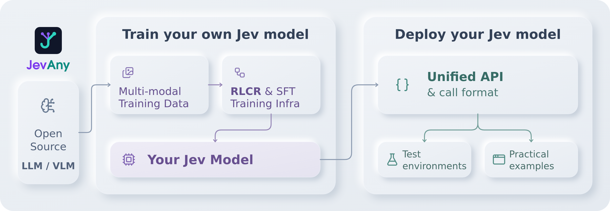
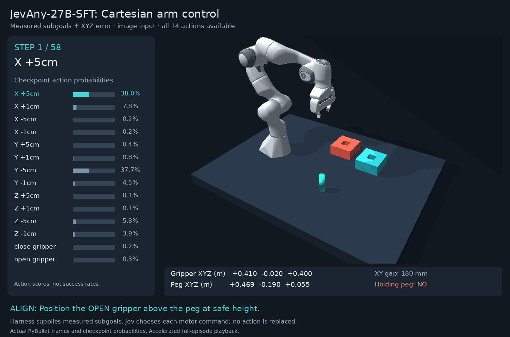
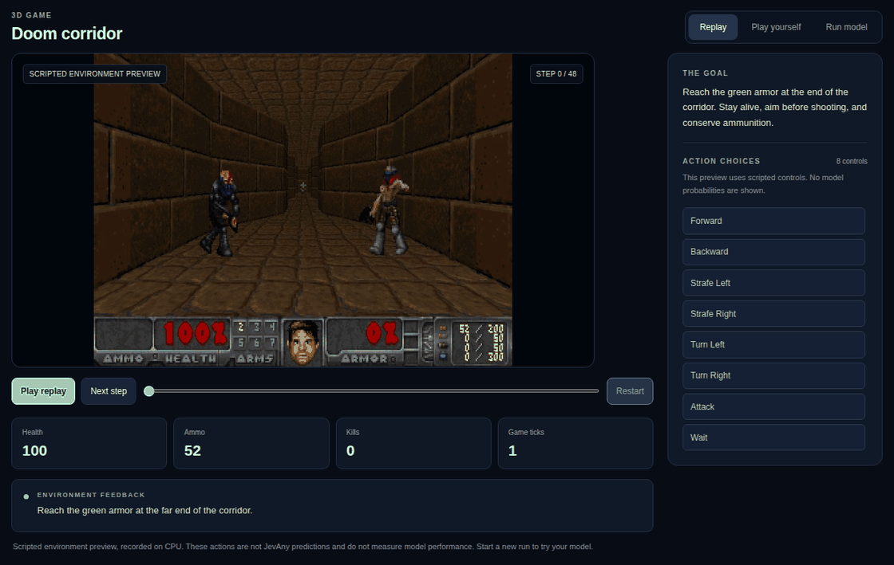
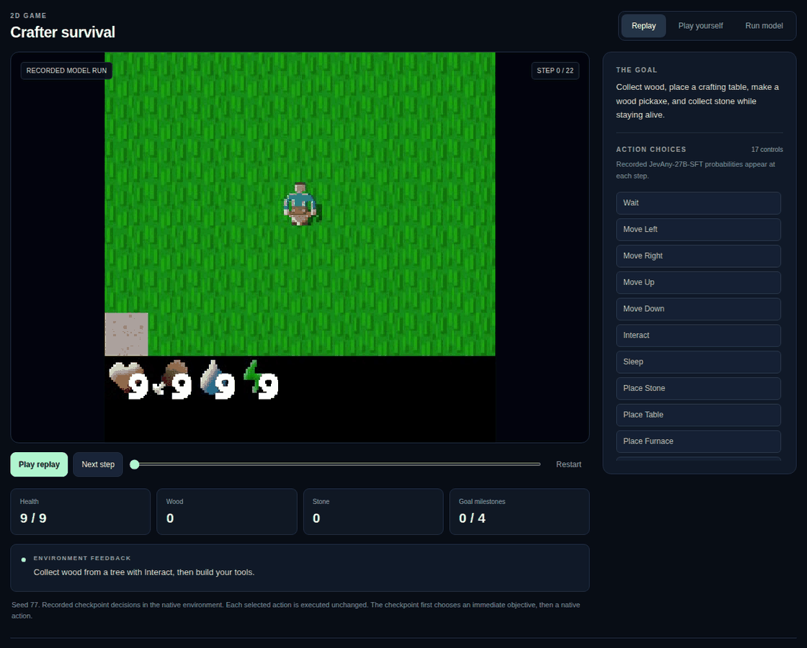
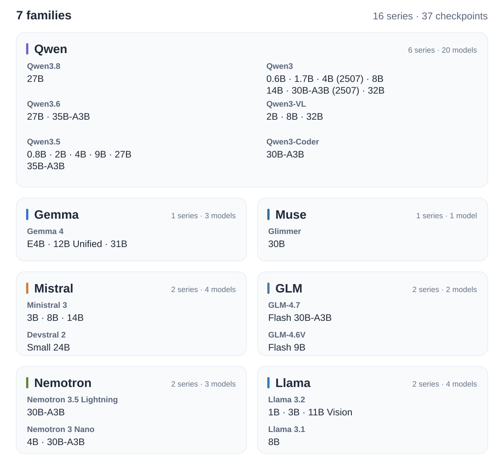

<p align="center">
  
</p>

<p align="center">
  <a href="https://simplejev.org/JevAny/"></a>
  <a href="https://huggingface.co/collections/SimpleJev/jevany-adaptive-decision-systems-6abc8fd39266b1c17b11b4e6"></a>
  <a href="docs/API.md"></a>
  <a href="docs/CASES.md"></a>
  <a href="pyproject.toml"></a>
  <a href="https://github.com/SimpleJev/JevAny/actions"></a>
  <a href="LICENSE"></a>
</p>

<p align="center">
  <strong>🇺🇸 English</strong> | <a href="README.zh-CN.md">🇨🇳 简体中文</a><br>
  <strong><a href="#results-and-demos">🎮 Results &amp; Demos</a> |
  <a href="#quickstart">⚡ Quickstart</a> |
  <a href="#run-locally">💻 Run locally</a> |
  <a href="#pretrained-models">🤗 Models</a> |
  <a href="#evaluation">📊 Benchmarks</a> |
  <a href="#documentation-and-contributing">📚 Docs</a></strong>
</p>

**JevAny is open infra for System 1 decision model training and deployment**,
covering data preparation, model adaptation and evaluation. Use a released
model or train on your own data to route support tickets, select tools, or
choose a robot's next action. One API takes the state, question and candidate
options, then directly returns a choice and its probabilities.

<p align="center">
  
</p>

## 🎮 Results and Demos <a name="results-and-demos"></a><a name="demos"></a>

[](#evaluation)

[Full benchmark results and evaluation details](#evaluation).

The following 30 examples are archived replays from an earlier compatible
JevAny checkpoint. The current default release is
[JevAny-Qwen3.8-27B](https://huggingface.co/SimpleJev/JevAny-Qwen3.8-27B-LoRA).
[Explore the cases](docs/CASES.md), or [run a model locally](#run-locally) to
try your own inputs and see its choices and probabilities.

[](docs/CASES.md)

### ⚡ Jev inside LLM agent loops

Jev chooses among valid, reversible actions proposed by the LLM, which handles
planning, recovery, and completion. The animations compare LLM only (left) with
LLM + Jev (right) at equal reward. Steps are illustrated; accelerated playback
preserves each pair's measured completion-time ratio. Click an animation to enlarge it.

**Golden rules**

- Delegate when the LLM can propose 2–4 valid, meaningfully different,
  reversible actions and the next observation can verify the choice.
- Keep planning, open-ended search, exact edits, recovery, high-risk actions,
  and completion with the LLM.
- Use Jev only when reward stays equal or improves while decision steps, tokens,
  or time fall; otherwise return control to the LLM.

<table>
  <tr>
    <td width="64%" valign="middle">
      <a href="docs/demos/jev-decision-webshop-v2.gif"></a>
    </td>
    <td width="36%" valign="middle">
      <p><strong>1. <a href="docs/demos/jev-agent-harness-traces.json">WebShop</a></strong><br>
      Jev selects the requested color and size from LLM-generated menus before the
      LLM buys the product. Actions fall from 9 to 5, LLM calls from 9 to 4,
      tokens from 38,852 to 14,256, and time from 18.54 to 7.83 seconds.</p>
    </td>
  </tr>
  <tr>
    <td width="64%" valign="middle">
      <a href="docs/demos/jev-decision-frozen-lake-v2.gif"></a>
    </td>
    <td width="36%" valign="middle">
      <p><strong>2. <a href="docs/demos/jev-agent-harness-traces.json">FrozenLake</a></strong><br>
      After one LLM plan, Jev checks each new state and chooses among four directions.
      Both runs reach the goal in 4 moves; LLM decision calls fall from 4 to 1,
      tokens from 2,338 to 663, and time from 19.7 to 16.7 seconds.</p>
    </td>
  </tr>
  <tr>
    <td width="64%" valign="middle">
      <a href="docs/demos/jev-decision-terminal-v2.gif"></a>
    </td>
    <td width="36%" valign="middle">
      <p><strong>3. <a href="reports/JevAny_Tech_Report_Agent_Harness_Appendix.md#h1-sqlite-recovery-a-meaningful-three-way-decision">Terminal-Bench</a></strong><br>
      For <code>sqlite-db-truncate</code>, Jev selects raw-page inspection from three
      commands, then the LLM recovers and verifies ten rows. Tool commands fall
      from 13 to 7, LLM calls from 15 to 8, tokens from 202,050 to 121,293, and
      time from 187.9 to 144.7 seconds.</p>
    </td>
  </tr>
</table>

Broader paired evaluations show that gains vary by task. The [full results](reports/JevAny_Tech_Report_Agent_Harness_Appendix.md),
[delegation protocol](docs/experiments/AGENT_HARNESS_FRONTIER_PROTOCOL.md), and
[technical report](reports/JevAny_Tech_Report.pdf) describe
where Jev helps and when to return control to the LLM.

| Task | Success | Efficiency |
|---|---:|---:|
| FrozenLake (GPT-5.6-sol, 10 pairs) | 100% → 100% | LLM calls −64.4%, tokens −63.1%, time −37.6% |
| WebShop (LLM-generated menus, 3 pairs) | 67% → 100% | LLM calls −21.4%, tokens −14.3%, time −15.0% |
| WebArena (6 pairs) | 50% → 50% | LLM calls +5.6%, tokens +28.2%, time −0.4% |
| Terminal-Bench (6 pairs) | 1/6 → 3/6 | LLM calls −9.0% |

## 📑 Table of Contents

- [🎮 Results and Demos](#results-and-demos)
- [⚡ 1. Quickstart](#quickstart)
  - [💻 1.1 Run locally](#run-locally)
  - [🛠️ 1.2 JevAny Training](#training)
  - [🚀 1.3 JevAny Deployment](#deployment)
- [🤗 2. Pretrained Models](#pretrained-models)
- [📊 3. Benchmark Results](#evaluation)
  - [⏱️ 3.1 Inference efficiency](#efficiency)
- [🕹️ 4. Examples & Test Environments](#examples--test-environments)
- [🧩 5. Supported Model Families](#supported-model-families)
- [📚 6. Documentation and Contributing](#documentation-and-contributing)

## ⚡ 1. Quickstart <a name="quickstart"></a>

Use Python 3.12 or newer. Clone the repository and install the lightweight package:

```bash
git clone https://github.com/SimpleJev/JevAny.git
cd JevAny
python3.12 -m venv .venv
source .venv/bin/activate
python -m pip install -e .
```

Keep this environment active and work from the repository root. Start with a
local demo, then [train on your own data](#training) or [use the API](#deployment).

### 💻 1.1 Run locally <a name="run-locally"></a>

Choose a model that fits your computer:

| Model | Hardware | Start here |
|---|---|---|
| Qwen 0.8B starter | CPU · 16 GB RAM recommended | [Train the small adapter](docs/TRAINING.md#start-with-a-small-backbone) on the bundled tickets |
| JevAny-Qwen 4B | CUDA · ~8 GB for BF16 base weights, plus runtime memory | [Load the released model](#deployment) |
| JevAny-Qwen 27B | CUDA · ~54 GB for BF16 base weights, plus runtime memory | [Choose the larger checkpoint](docs/PLAYGROUND.md#choose-and-load-a-model) |

The [local model guide](docs/PLAYGROUND.md) covers preparation and loading.
Released models download on first use and reuse the local cache. With the model
server running, open a second terminal in the same checkout:

```bash
source .venv/bin/activate
jevany demo --base-url http://127.0.0.1:8008 --text-only
```

Open `http://127.0.0.1:8090`, choose **Test and connect**, then edit
**Try your own decision** and press **Ask the model**. Change the state or options
to see how its decision changes. [Games, robotics and replays](#try-the-playground)
are available in the same playground.

### 🛠️ 1.2 JevAny Training <a name="training"></a>

Train your own System 1 model on the same `state` and `questions` you send at
inference, with a label for each question. Start with the bundled synthetic
support tickets, then train on your own labelled data. The starter recipe uses
Qwen3.5-0.8B on CUDA with BF16 and writes `runs/my-jev`:

```bash
python -m pip install -e '.[train]'
jevany data init --out data/starter
jevany data validate data/starter/train.jsonl
jevany train --config recipes/sft.toml --dry-run
jevany train --config recipes/sft.toml
```

After training, try the checkpoint on the included ticket request:

```bash
jevany decide examples/request.json --checkpoint runs/my-jev
```

Pass `--data` to train on your own [JSONL data](docs/DATA.md), or use
[`recipes/finetune.toml`](recipes/finetune.toml) to adapt the released 27B model.
See the [training guide](docs/TRAINING.md) for CPU settings, multimodal data and
standard `torchrun` launches. For image/video training or fine-tuning the released
27B model, install `.[train,multimodal]`.

After SFT, you can continue with experimental [RLCR](docs/ALGORITHM.md#rlcr),
which rewards correctness and probability calibration:

```bash
jevany train --config recipes/rlcr.toml
```

### 🚀 1.3 JevAny Deployment <a name="deployment"></a>

Install the serving dependencies and start the released Qwen 4B model on a CUDA
GPU. See the [hardware and loading guide](docs/DEPLOYMENT.md#checkpoints-and-hardware)
for memory requirements.

```bash
python -m pip install -e '.[serve,multimodal]'
jevany serve --checkpoint SimpleJev/JevAny-Qwen3.5-4B-LoRA \
  --device cuda --dtype bf16 --port 8008
```

The default path favors reproducibility. CUDA deployments can opt into BF16
LoRA merging, SDPA and `torch.compile`; the useful settings differ between 4B
and 27B. See the [inference acceleration guide](docs/DEPLOYMENT.md#optional-cuda-acceleration)
for commands, H200 measurements and accuracy caveats.

To serve your training output, replace the checkpoint ID with `runs/my-jev`.
Keep the server running. In a Python session using the same environment, send
a ticket and the departments that can handle it:

```python
from jevany import Choice, JevClient

jev = JevClient("http://127.0.0.1:8008")
result = jev.system_one(
    state={"ticket": "I was charged twice. Please help."},
    questions={
        "department": Choice(
            instructions="Which team should handle this?",
            criteria={"billing": "Payment problems", "shipping": "Delivery problems"},
        ),
    },
)
answer = result["answers"]["department"]
print("Selected team:", answer["choice"])
print("Probabilities:", answer["probabilities"])
```

`choice` is one of the department names; `probabilities` maps each name to its
probability. Your application can use these fields to route the ticket or ask
for review when the decision is uncertain. Use `Noul` for yes/no questions,
such as whether a ticket needs urgent review,
and `Score` for ordered levels, such as low, normal and high priority.
See the [API reference](docs/API.md) for all three question types.

For in-process inference, [load a model in Python](docs/DEPLOYMENT.md#python)
and use the same interface. For image and video inputs, follow the
[media setup](docs/DEPLOYMENT.md#native-media-and-limits).

## 🤗 2. Pretrained Models <a name="pretrained-models"></a>

For a first local run, choose a model and hardware in [Run locally](#run-locally).

| Model | Readout | Intended use |
|---|---|---|
| [&nbsp;JevAny-Gemma-4B](https://huggingface.co/SimpleJev/JevAny-Gemma-4B-LoRA) | Pointer | Compact Gemma release |
| [&nbsp;JevAny-Qwen3.5-4B](https://huggingface.co/SimpleJev/JevAny-Qwen3.5-4B-LoRA) | Pointer | Compact, flexible choice count |
| [&nbsp;JevAny-Qwen3.5-4B-Direct-Token](https://huggingface.co/SimpleJev/JevAny-Qwen3.5-4B-Direct-Token-LoRA) | Direct-token | Best released 4B JevBench accuracy |
| [&nbsp;JevAny-Qwen3.8-27B](https://huggingface.co/SimpleJev/JevAny-Qwen3.8-27B-LoRA) | Pointer | Default; highest released accuracy |
| [&nbsp;JevAny-Muse-Glimmer-30B](https://huggingface.co/SimpleJev/JevAny-Muse-Glimmer-30B-LoRA) | Pointer | Muse Glimmer alternative |

These LoRA adapters were trained with SFT on 1,772,725 text records containing
2,180,242 labelled decisions; see [training compute and experiments](reports/JevAny_Tech_Report.pdf)
for the setup. Full-parameter SFT and further post-training improvements are planned.

The corresponding base model is loaded separately and its license and access
terms apply. Allow roughly twice the base parameter count in bytes for BF16
weights, plus runtime memory. See the
[hardware and loading guide](docs/DEPLOYMENT.md#checkpoints-and-hardware).

Pointer and direct-token models share the same API. Pointer supports up to
4,096 options within the context limit; direct-token supports up to 255.
See [readout choices](docs/TRAINING.md#pointer-and-direct-token-readouts) for
training and accuracy tradeoffs.

## 📊 3. Benchmark Results <a name="evaluation"></a>

JevAny-Qwen3.8-27B leads both benchmarks and has the lowest NLL and Brier.
Among 4B releases, direct-token leads on JevBench; pointer leads on Transfer.

[](docs/evaluation-overview.svg)

<div align="center">

| Model | Transfer ↑ | JevBench ↑ | NLL ↓ | Brier ↓ | ECE ↓ |
|:---|---:|---:|---:|---:|---:|
| [&nbsp;Kev-4B](https://huggingface.co/jaredpalmer/kev-4b) | 74.19% | 75.32% | 0.858 | 0.380 | 0.125 |
| [&nbsp;Kev-27B](https://huggingface.co/jaredpalmer/kev-27b) | 82.31% | 85.28% | 0.533 | 0.265 | 0.050 |
| [&nbsp;Jev 1.13.0](https://docs.typesafe.ai/models) | 85.37% | 86.58% | 0.644 | 0.212 | 0.033 |
| [&nbsp;Laya](https://huggingface.co/convaiinnovations/laya) | 52.29% | 58.01% | 1.264 | 0.615 | 0.127 |
| **JevAny releases** |  |  |  |  |  |
| [&nbsp;JevAny-Gemma-4B](https://huggingface.co/SimpleJev/JevAny-Gemma-4B-LoRA) | 70.84% | 77.49% | 0.706 | 0.369 | 0.056 |
| [&nbsp;JevAny-Qwen3.5-4B](https://huggingface.co/SimpleJev/JevAny-Qwen3.5-4B-LoRA) | 78.68% | 80.09% | 0.587 | 0.297 | 0.035 |
| [&nbsp;JevAny-Qwen3.5-4B-Direct-Token](https://huggingface.co/SimpleJev/JevAny-Qwen3.5-4B-Direct-Token-LoRA) | 78.20% | 80.95% | 0.564 | 0.291 | **0.029** |
| [&nbsp;JevAny-Muse-Glimmer-30B](https://huggingface.co/SimpleJev/JevAny-Muse-Glimmer-30B-LoRA) | 83.46% | 87.45% | 0.464 | 0.229 | 0.032 |
| [&nbsp;**JevAny-Qwen3.8-27B**](https://huggingface.co/SimpleJev/JevAny-Qwen3.8-27B-LoRA) | **86.04%** | **90.04%** | **0.388** | **0.195** | **0.026** |

NLL, Brier and ECE are measured on Transfer.

</div>

[Full results and protocols](docs/EVALUATION.md#model-family-v2) ·
[Machine-readable results](results/model-family-v2.json) ·
[Method and ablation report](reports/JevAny_Tech_Report.pdf)

### ⏱️ 3.1 Inference efficiency <a name="efficiency"></a>

On one H200, direct CUDA Graphs cut Qwen3.8-27B median latency from
**113.54 ms to 30.53 ms (3.72×)** with 207/231 correct answers before and
after. The A100-40GB comparison below uses batch size 1: 4B models fit on one
GPU and use CUDA Graphs, while 27B and 30B are layer-sharded over three GPUs
and gain only from linear-attention kernels and fused SDPA.

[](docs/EFFICIENCY.md)

| Model | A100 GPUs | Default | Accelerated | Speed-up | Transfer accuracy |
|:---|---:|---:|---:|---:|---:|
| JevAny-Qwen3.5-4B | 1 | 104.6 ms | **25.3 ms** | **4.1×** | 78.68% → 78.87% |
| JevAny-Qwen3.5-4B-Direct-Token | 1 | 106.4 ms | **25.9 ms** | **4.1×** | 78.11% → 78.39% |
| JevAny-Gemma-4B | 1 | 106.3 ms | **31.9 ms** | **3.3×** | 70.84% → 70.84% |
| JevAny-Muse-Glimmer-30B | 3 | 171.2 ms | **154.2 ms** | **1.11×** | 83.37% → 83.37% |
| JevAny-Qwen3.8-27B<sup>†</sup> | 3 | 240.2 ms | **220.1 ms** | **1.09×** | 85.66% → 85.66% |

Median per-request latency on Transfer-v9, batch size 1.
<sup>†</sup> Measured at step 22,160.

[Full tables, setup and other models](docs/EFFICIENCY.md) ·
[How to enable](docs/DEPLOYMENT.md#optional-cuda-acceleration) ·
[Machine-readable results](results/efficiency-a100-v1.json)

## 🕹️ 4. Examples & Test Environments <a name="examples--test-environments"></a>

The playground includes the three environments below. These GIFs preserve
historical model actions and option probabilities; run the current
[JevAny-Qwen3.8-27B](https://huggingface.co/SimpleJev/JevAny-Qwen3.8-27B-LoRA)
checkpoint with the commands in the playground guide.

### 🤖 4.1 [Robot peg insertion](examples/README.md#robot-peg-insertion) <a name="robot-peg-insertion"></a>

Use a Franka gripper to grasp, align and insert a peg, checked by PyBullet contact physics.

[](examples/README.md#robot-peg-insertion)

### 🔫 4.2 [Doom corridor · 3D](examples/README.md#doom-corridor-3d) <a name="doom-corridor-3d"></a>

Clear the final room by defeating the enemies on the left and right, then move
forward. The environment uses ViZDoom and the included Freedoom assets.

[](examples/README.md#doom-corridor-3d)

### ⛏️ 4.3 [Crafter survival · 2D](examples/README.md#crafter-survival-2d) <a name="crafter-survival-2d"></a>

Gather wood, craft tools and mine stone while managing health and supplies.

[](examples/README.md#crafter-survival-2d)

### 🎮 4.4 Try the playground <a name="try-the-playground"></a>

With a model running from [Run locally](#run-locally), open the playground:

```bash
jevany demo --base-url http://127.0.0.1:8008 --text-only
```

Open `http://127.0.0.1:8090`, choose **Test and connect**, and try your own
decision. To let the model control a game, install the optional engines and
restart the playground:

```bash
python -m pip install -e '.[demo]'
jevany demo --base-url http://127.0.0.1:8008 --text-only
```

Choose **Run model**, then **One decision** or **Run automatically**.
**Play yourself** lets you control the game. Live control sends text state to the
model; robot control uses the `.[robotics]` extra.

For the bundled recordings, run `jevany demo` and choose **Replay**.
Playback works on CPU without model weights.
See the [playground guide](examples/README.md) for platform
requirements and environment APIs, or [integrations](docs/INTEGRATIONS.md) to
combine JevAny decisions with an LLM planner.

## 🧩 5. Supported Model Families <a name="supported-model-families"></a>

[Model IDs, supported inputs and setup requirements](docs/TRAINING.md#backbone-support).

[](docs/TRAINING.md#backbone-support)

## 📚 6. Documentation and Contributing <a name="documentation-and-contributing"></a>

[Training](docs/TRAINING.md) · [Deployment](docs/DEPLOYMENT.md) · [API](docs/API.md) · [Data](docs/DATA.md) · [Evaluation](docs/EVALUATION.md) · [Agent harness protocol](docs/experiments/AGENT_HARNESS_FRONTIER_PROTOCOL.md) · [Contributing](CONTRIBUTING.md)

To contribute a model adapter, evaluation or application example, start with the
[contribution guide](CONTRIBUTING.md). The
[technical report](reports/JevAny_Tech_Report.pdf) describes model design,
multimodal support, the agent-harness study and appendix, negative results, and
open questions.

Code and starter data are Apache-2.0. Some components are adapted from
[Kev](https://github.com/jaredpalmer/kev); see [NOTICE](NOTICE) and
[ACKNOWLEDGEMENTS.md](ACKNOWLEDGEMENTS.md). Base models and upstream datasets retain their own terms.
