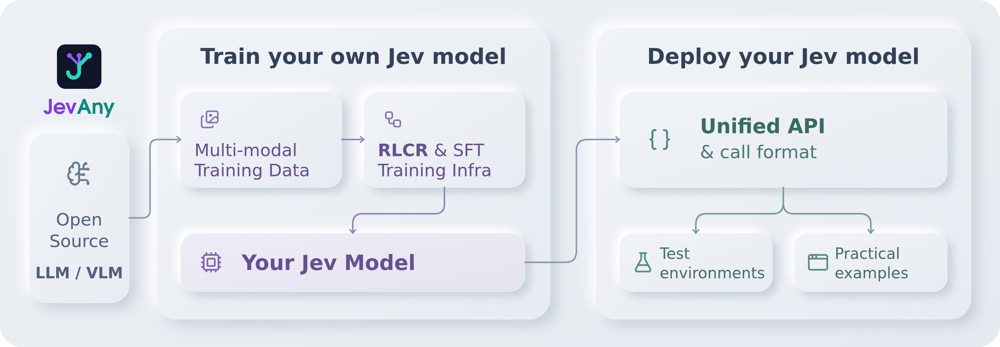
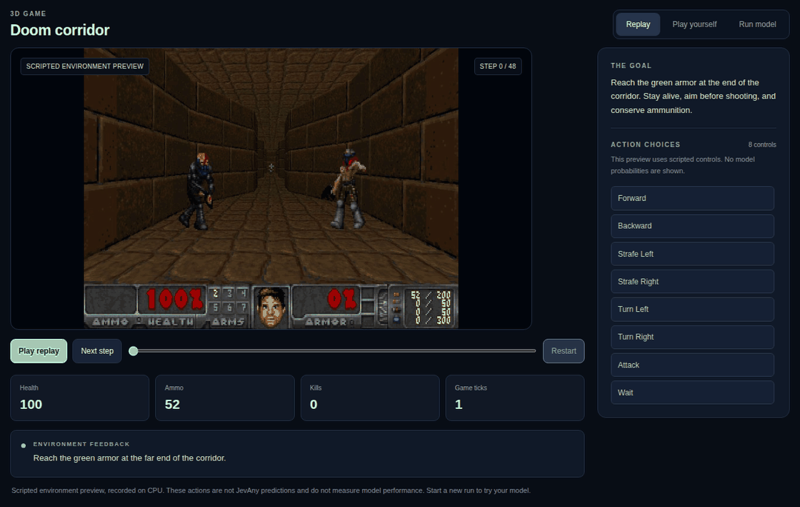
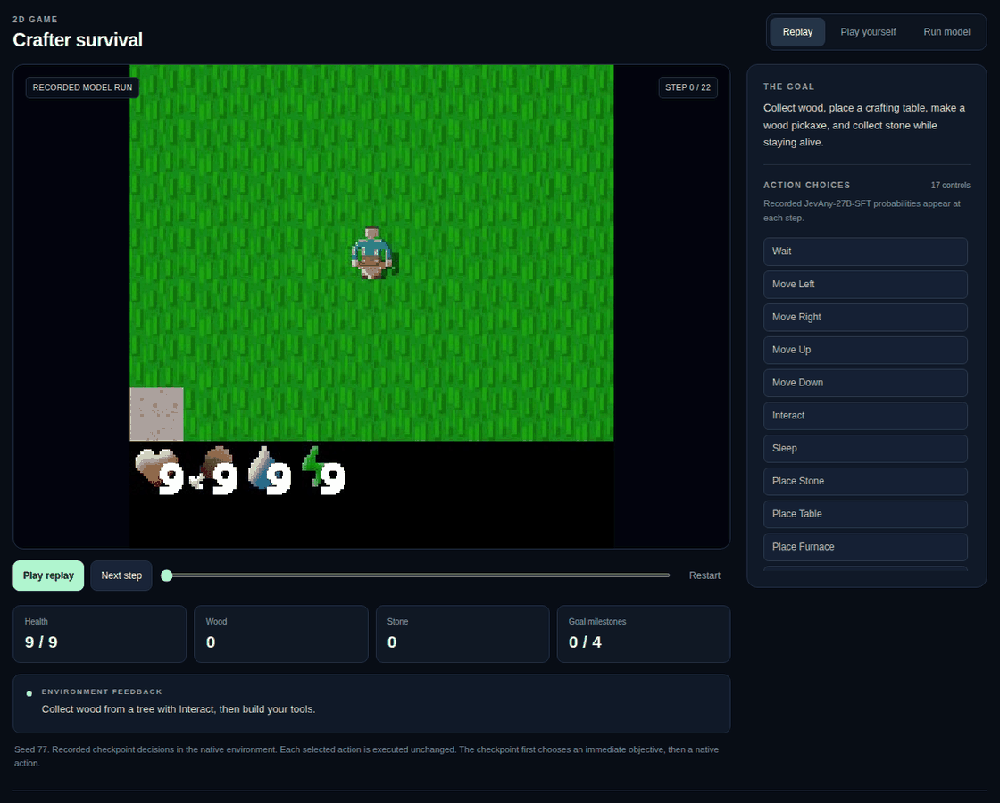
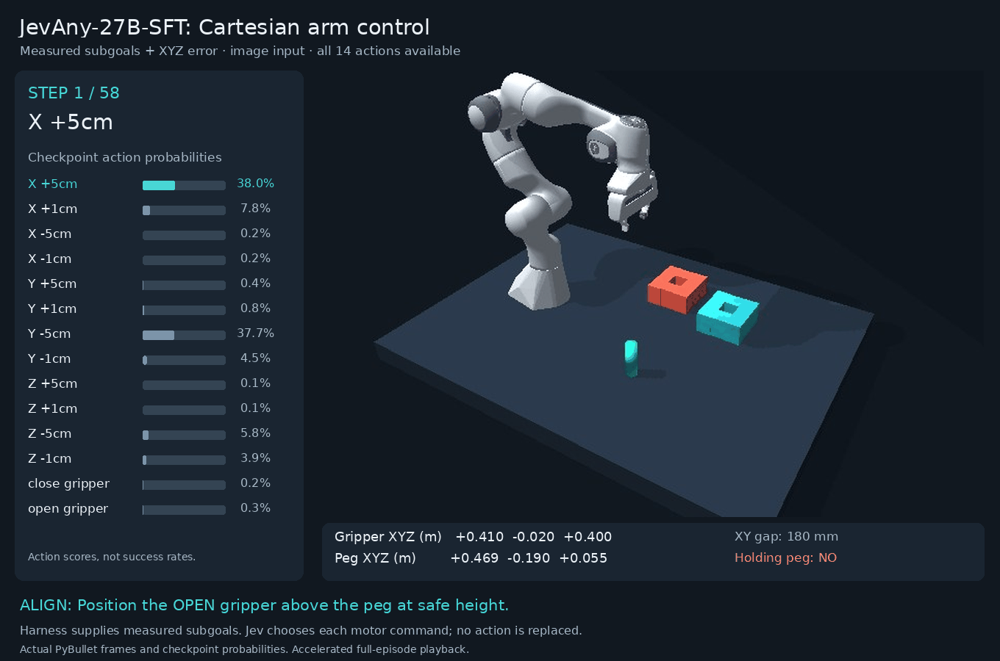
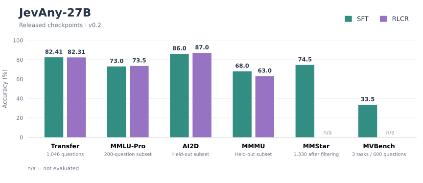

<p align="center">
  
</p>

<p align="center">
  <a href="https://huggingface.co/collections/tianxinwei/jevany-adaptive-decision-systems-6ab2c941bcecb4d2c61d1326"></a>
  <a href="docs/API.md"></a>
  <a href="docs/CASES.md"></a>
  <a href="pyproject.toml"></a>
  <a href="https://github.com/weitianxin/JevAny/actions"></a>
  <a href="LICENSE"></a>
</p>

<p align="center">
  <a href="README.md">English</a> | <strong>简体中文</strong>
</p>

JevAny 用于训练和部署 Jev 风格的决策模型：你可以微调开源语言模型，也可以使用预训练 checkpoint。两者共用兼容 Jev 格式的 [Python 和 HTTP API](docs/API.md)，输入状态、问题与候选答案，即可获得选择及各选项的概率。

<p align="center">
  
</p>

| 从这里开始 | JevAny 提供什么 |
|---|---|
| **[训练](#训练)** | 训练数据和统一的 SFT/RLCR 训练框架 |
| **[推理与部署](#推理与部署)** | 预训练模型、统一 API、测试环境与应用示例 |

## 演示

以下案例使用 [JevAny-27B-SFT](https://huggingface.co/tianxinwei/JevAny-27B-SFT)：

[](docs/CASES.md)

[查看 30 个精选成功案例](docs/CASES.md)，或通过[示例与测试环境](#示例与测试环境)试用自己的模型。

## 安装

使用 Python 3.12 或更新版本。克隆仓库并创建环境：

```bash
git clone https://github.com/weitianxin/JevAny.git
cd JevAny
python3.12 -m venv .venv
source .venv/bin/activate
```

按用途选择依赖：

| 用途 | 安装命令 |
|---|---|
| 调用已有 HTTP 服务 | `python -m pip install -e .` |
| 训练文本模型 | `python -m pip install -e '.[train]'` |
| 在本地运行文本模型或启动 HTTP 服务 | `python -m pip install -e '.[serve]'` |
| 运行支持原生媒体输入的已发布 27B 模型 | `python -m pip install -e '.[serve,multimodal]'` |

只安装客户端不会引入 PyTorch。训练图片/视频模型时，使用 `.[train,multimodal]`。以下命令均在仓库根目录运行；具体模型的硬件要求见[预训练模型](#预训练模型)。

## 训练

### 训练数据

训练数据沿用推理时的 `state` 和 `questions`，并为每个问题增加 `label`。

| 数据 | 提供的内容 | 使用入口 |
|---|---|---|
| 随包入门数据 | 用于熟悉训练流程的小型合成数据集 | `jevany data init --out data/starter` |
| 公开数据构建器 | 文本、图片和视频决策数据 | [数据构建指南](docs/TRAINING.md#data-beyond-the-starter) |
| 自己的数据 | 按统一 JSONL 格式添加标签的请求 | [格式与示例](docs/DATA.md) |

训练前先准备并校验入门数据：

```bash
jevany data init --out data/starter
jevany data validate data/starter/train.jsonl
```

### SFT

监督微调让 Jev 模型学习带标签的决策。在 CUDA GPU 上运行入门 recipe：

```bash
jevany train --config recipes/sft.toml --dry-run
jevany train --config recipes/sft.toml
```

Checkpoint 保存到 `runs/my-jev`。使用自己的数据时，添加 `--data data/my-domain.jsonl --out runs/domain-jev`。微调已发布的 Jev 模型可使用 [`recipes/finetune.toml`](recipes/finetune.toml)。

### RLCR

RLCR（Reinforcement Learning with Calibration Rewards）在 SFT 后继续训练，奖励同时考虑答案是否正确及其置信度。完成上面的 SFT recipe 后，运行：

```bash
jevany train --config recipes/rlcr.toml
```

该 recipe 从 `runs/my-jev` 继续训练，保存到 `runs/my-jev-rlcr`。RLCR 仍在开发完善中，详见[训练目标](docs/ALGORITHM.md#rlcr)。

支持的基座、图片和视频能力，以及本地 GPU 用法见[训练指南](docs/TRAINING.md#backbone-support)。

## 预训练模型

| 模型 | 用途 |
|---|---|
| [JevAny-27B-SFT](https://huggingface.co/tianxinwei/JevAny-27B-SFT) | 默认发布模型 |
| [JevAny-27B-RLCR](https://huggingface.co/tianxinwei/JevAny-27B-RLCR) | RLCR 实验版本 |

两个版本首次使用时都会加载 27B 视觉基座。单个设备需容纳约 54 GB 的 BF16 基座权重及额外运行内存。也可以训练更小的模型，再通过同一 API 部署。详见[硬件与加载说明](docs/DEPLOYMENT.md#checkpoints-and-hardware)。

## 推理与部署

### Python API

[HTTP 服务](#http-服务)启动后，发送状态和带有候选选项的问题。返回值包含选中的选项及各选项的概率：

```python
from jevany import Choice, JevClient

state = {"ticket": "I was charged twice. Please help."}
questions = {
    "department": Choice(
        instructions="Which team should handle this?",
        criteria={"billing": "Payment problems", "shipping": "Delivery problems"},
    ),
}

jev = JevClient("http://127.0.0.1:8008")
result = jev.system_one(state=state, questions=questions)
answer = result["answers"]["department"]
print(answer["choice"])
print(answer["probabilities"])
```

二分类问题使用 `Noul`，有序评分使用 `Score`。[API 文档](docs/API.md) 介绍了三种问题类型及兼容 Jev 的请求/返回格式。

### HTTP 服务

运行默认发布模型时，安装 `.[serve,multimodal]`，并使用满足 [27B 硬件要求](#预训练模型)的设备：

```bash
jevany serve --checkpoint tianxinwei/JevAny-27B-SFT \
  --device cuda --dtype bf16 --port 8008
```

部署前面 SFT 示例训练的小模型时，运行：

```bash
jevany serve --checkpoint runs/my-jev --model-name my-jev --port 8008
```

### 进程内推理

在应用中加载一次 checkpoint，复用上例中的 `state` 和 `questions`：

```python
from jevany import JevModel

jev = JevModel.from_pretrained("runs/my-jev", model_name="my-jev")
result = jev.system_one(state=state, questions=questions)
```

更多模型调用方式见[部署指南](docs/DEPLOYMENT.md)，图片和视频输入见[媒体配置](docs/DEPLOYMENT.md#native-media-and-limits)。

## 示例与测试环境

在本地浏览器中打开交互演示。内置回放不需要 GPU、模型下载或推理服务：

```bash
python -m pip install -e .
jevany demo
```

以下动图录自本地浏览器的 **Replay** 界面，已加速。机械臂回放保留了 JevAny-27B-SFT 的实际决策和原始选项概率。两个游戏的预览明确标注为脚本控制，不代表模型表现。

### [Doom 走廊 · 3D](examples/README.md#doom-corridor-3d)

使用 ViZDoom 和随包提供的 Freedoom 资源，在走廊中移动、瞄准和战斗。



### [Crafter 生存建造 · 2D](examples/README.md#crafter-survival-2d)

采集木材、制作工具、开采石头，同时管理生命值和物资。



### [机械臂插孔](examples/README.md#robot-peg-insertion)

控制 Franka 夹爪抓取、对准并插入工件，由 PyBullet 接触物理验证结果。



### 实时控制

安装可选游戏引擎后，可以自己操作，也可以连接[已启动的模型服务](#http-服务)，在浏览器中选择 **Run model**：

```bash
python -m pip install -e '.[demo]'
jevany demo --base-url http://127.0.0.1:8008 --text-only
```

实时模型决策目前使用文本状态。机械臂控制使用单独的 `.[robotics]` 依赖。安装步骤、平台要求和环境接口见[演示指南](examples/README.md)，结合 LLM 规划器使用 Jev 决策可参考[集成文档](docs/INTEGRATIONS.md)。

## 评测



[完整结果与评测设置](docs/EVALUATION.md)。

## 文档与贡献

[训练](docs/TRAINING.md) · [部署](docs/DEPLOYMENT.md) · [API 兼容性](docs/API.md) · [数据](docs/DATA.md) · [评测](docs/EVALUATION.md) · [贡献指南](CONTRIBUTING.md)

JevAny 独立于 Jev 和 TypeSafe，不包含 Jev 权重或私有实现。部分基础设施改编自 [Kev](https://github.com/jaredpalmer/kev)，归属说明见 [NOTICE](NOTICE) 和 [ACKNOWLEDGEMENTS.md](ACKNOWLEDGEMENTS.md)。代码和入门数据采用 Apache-2.0；基础模型与上游数据集保留各自条款。
