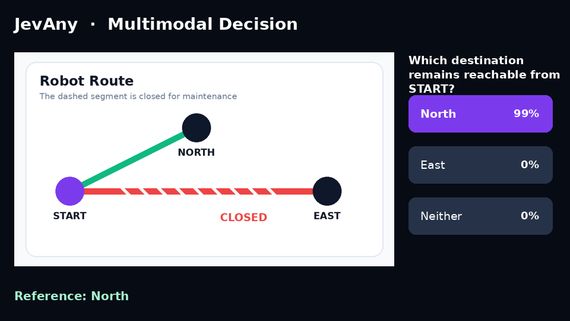
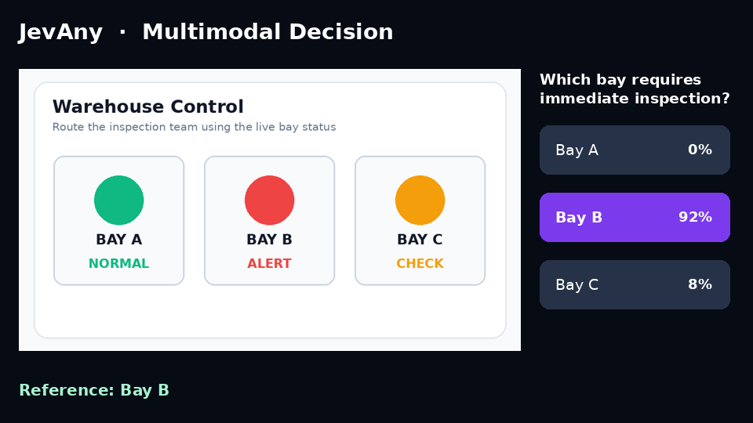
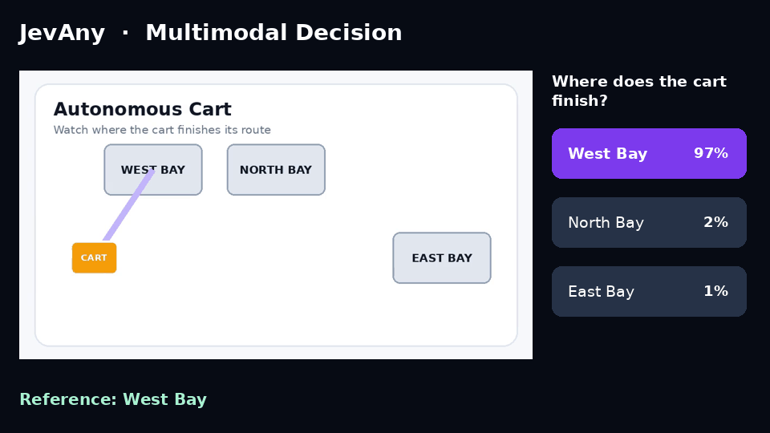
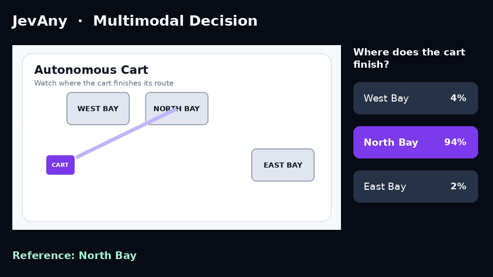

# Evaluation

SFT is the default checkpoint. RLCR improved development NLL by 0.005 and did not improve transfer accuracy.

The [v0.2 release record](../results/release-v0.2.json) reports results on 1,004 development questions and 1,046 transfer questions. NLL (negative log-likelihood) penalizes low probability on the correct answer; lower is better.

| Model | Development accuracy | Development NLL ↓ | Transfer accuracy | MMLU-Pro | AI2D | MMMU |
|---|---:|---:|---:|---:|---:|---:|
| **JevAny-27B-SFT v2** | **90.34%** | 0.265 | **82.41%** | 73.0% | 86.0% | **68.0%** |
| JevAny-27B-RLCR v2 | 89.74% | **0.260** | 82.31% | **73.5%** | **87.0%** | 63.0% |
| Jev | n/a | n/a | 85.37% | 84.0% | n/a | n/a |

RLCR changed transfer accuracy by `-0.10` percentage points against SFT, with 3 fixes and 4 regressions. The paired 95% bootstrap interval is `[-0.58, 0.39]` points. The small development NLL gain did not survive independent calibration. Jev is a different hosted system evaluated through the same decision suite, not a weight-matched ablation.

Development accuracy and NLL exclude 100 VideoFeedback questions whose labels are all the same highest score. Those questions did exercise the video path, but a slice with one label cannot show temporal understanding, so we do not report it as a capability score. AI2D and MMMU use native images through the backbone's vision path. The training set also contains native A-OKVQA and ScienceQA images.

  

### Native image and video decisions

We evaluated the released SFT checkpoint with the real media, a neutral blank asset, and media shuffled between questions within each task. We shuffle by unique media group, so questions that share one image or video receive the same replacement. The media sensitivity gate requires full-media accuracy to exceed the stronger control by at least five points, with a positive paired media-group bootstrap interval. Passing the gate shows that the model reads the media; task accuracy is a separate question.

| Panel | Questions | Full media | Blank | Shuffled | Gain over strongest control |
|---|---:|---:|---:|---:|---:|
| MMStar clean image panel | 1,330 | **74.5%** | 29.0% | 28.9% | **+45.5** `[+42.4, +48.6]` |
| MVBench three-task video panel | 600 | **33.5%** | 12.3% | 15.3% | **+18.2** `[+13.9, +22.4]` |

| MVBench task | Questions | Full media | Blank | Shuffled | Gain over strongest control |
|---|---:|---:|---:|---:|---:|
| Fine-grained action | 200 | **45.0%** | 14.0% | 16.5% | **+28.5** `[+19.5, +37.5]` |
| Egocentric navigation | 200 | **43.5%** | 23.0% | 29.0% | **+14.5** `[+6.3, +22.4]` |
| Action antonym | 200 | **12.0%** | 0.0% | 0.5% | **+11.5** `[+7.0, +16.0]` |

From the image panel we dropped invalid choices and every item that matched the training, calibration, or development splits by media or by normalized question and unordered option text. No exact or perceptual media overlap, question-option overlap, or source-ID overlap remains. Its task-macro random and label-position baselines are 26.7% and 31.8%. The video panel passes the same zero-overlap checks. Its overall media gain is significant, though the action-antonym score is low and the video probabilities are badly calibrated.

Full metrics, per-task intervals, dataset revisions, checkpoint hashes, and control provenance are in [the image report](../results/multimodal-image-v1.json) and [the video report](../results/multimodal-video-v1.json). The internal evaluation checkpoint and public SFT release have identical LoRA and pointer-head tensors; [the equivalence record](../results/release-equivalence-v0.2.json) accounts for the embedded release temperature. Upstream terms keep us from redistributing the benchmark media.

The examples below use synthetic media we made and released with this repository. Both cases per modality come from a predeclared set of three, and [the selection record](demos/multimodal-demo.json) lists every probability. The two video cases put the same question to different clips, so only the motion separates the answers.

<table>
  <tr>
    <td width="50%" align="center"> <b>Jev-Image: which destination is still reachable</b></td>
    <td width="50%" align="center"> <b>Jev-Image: which bay needs inspection</b></td>
  </tr>
  <tr>
    <td width="50%" align="center"> <b>Jev-Video: the cart finishes west</b></td>
    <td width="50%" align="center"> <b>Jev-Video: the cart finishes north</b></td>
  </tr>
</table>

### Jev-Agent

<table>
  <tr>
    <td width="50%" align="center"> <b>FrozenLake</b> 98% of 50 episodes solved</td>
    <td width="50%" align="center"> <b>Sokoban</b> 48% of 50 episodes solved</td>
  </tr>
</table>

We expose only the legal actions at each step, and JevAny picks one without generating text. FrozenLake lets you recover from a bad step. Sokoban gives you no way to undo a push, so one choice can decide the episode.

### Jev-Test

We tested transductive adaptation without ground-truth labels. The parent produced 16 stochastic decisions per input, a strict majority became the pseudo label, and we dropped ties. We locked the protocol before scoring the adapted models against gold labels.

| Dataset | Parent accuracy | Pseudo-label SFT | Pseudo-label RLCR | Parent NLL | SFT NLL | RLCR NLL |
|---|---:|---:|---:|---:|---:|---:|
| MMLU-Pro | **73.00%** | 72.00% | 72.00% | 0.942 | **0.930** | 0.933 |
| MuSR | 60.71% | **61.11%** | 60.98% | **1.122** | 1.552 | 1.483 |

MMLU-Pro NLL improved by 0.012 while accuracy fell a point. MuSR accuracy moved by at most 0.40 points while its NLL rose from 1.122 to 1.552. This self-training recipe is a negative result, and the code stays experimental. The [locked protocol](../results/ttt-protocol-v1.json) and [release measurements](../results/release-v0.2.json) document the full experiment.
